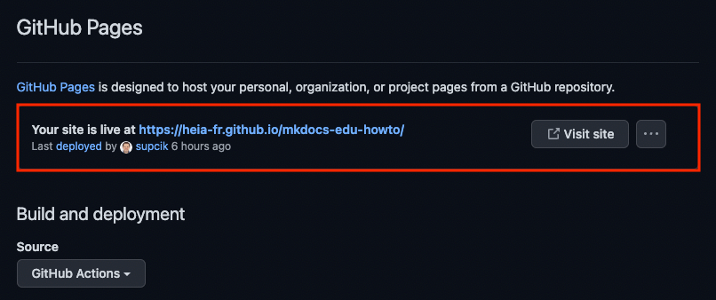
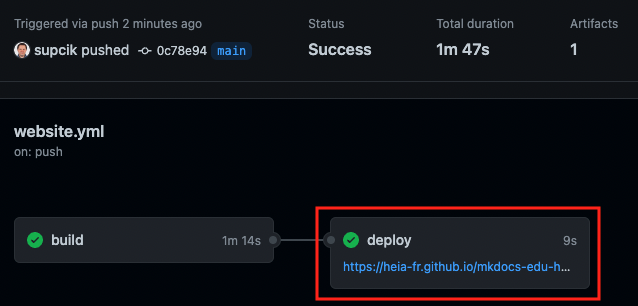

# {{ page.title }}

Pour rendre votre site disponible sur Internet, vous avez plusieurs solutions :

- [GitHub Pages](https://pages.github.com/)
- [GitLab Pages](https://docs.gitlab.com/ee/user/project/pages/)
- [Netlify](https://www.netlify.com/)
- [Vercel](https://vercel.com/)
- et bien d'autres encore...

Je décris ici la méthode pour utiliser les _GitHub Pages_
et pour les _Gitlab Pages_, mais toutes
les options ci-dessus sont possibles avec MkDocs.

## Github Pages

!!! warning "Attention"
    La technique expliquée ici est une
    [nouvelle manière](https://github.blog/changelog/2022-07-27-github-pages-custom-github-actions-workflows-beta/)
    de publier sur GitHub Pages. Cette technique est encore en _Bêta_, mais elle est
    plus simple à utiliser que la technique précédente et fonctionne déjà très bien.

Pour utiliser _GitHub Pages_, vous devez héberger votre projet dans un dépôt git
de GitHub.

Modifiez les paramètres des _GitHub Pages_ en cliquant le menu _Settings_
--> _Pages_ et définissez _GitHub Actions_ comme source :

{ width="80%" }


Créez ensuite les dossiers `.github` et `.github/workflows` à la racine de votre projet

Ajoutez-y le fichiers de suivant:

```yaml title=".github/workflows/website.yml"

{! include "../.github/workflows/website.yml" ignore missing !}

```


Lors du prochain _push_ avec ces nouveaux fichiers, l'action de github
publiera le contenu de votre site sur _GitHub Pages_.

Vous obtenez l'URL à laquelle le site a été publié, en retournant dans _Settings_ --> _Pages_ :

{ width="80%" }

ou en consultant le résultat de l'action :

{ width="80%" }

Après avoir sauvé cette configuration, modifiez encore le fichier `mkdocs.yml` avec l'URL
que vous avez dans les _settings_ :

```yaml title="mkdocs.yml" hl_lines="2"
site_name: My Education Site
site_url: https://heia-fr.github.io/mkdocs-edu-howto/
...
```

Faites un _commit_ et un _push_ et votre site devrait être publié
à l'URL adéquate.

Grâce aux _GitHub Actions_, votre site sera automatiquement publié
lors de chaque _push_ de la branche _main_ du projet.

## Gitlab Pages

Pour utiliser _GitLab Pages_, vous devez héberger votre projet dans un dépôt git
de GitLab.

Créez ensuite un fichier `.gitlab-ci.yml` à la racine de votre projet avec
le contenu suivant :

```yaml title=".gitlab-ci.yml"

{! include "../.gitlab-ci.yml" ignore missing !}

```

Lors du prochain _push_ avec ce nouveau fichier, le CI/CD de gitlab
publiera votre site.

Allez dans Settings --> Pages pour découvrir l'URL de votre site.

Modifiez le fichier `mkdocs.yml` avec cette URL.

```yaml title="mkdocs.yml" hl_lines="2"
site_name: My Education Site
site_url: https://heia-fr.gitlab.io/mkdocs-edu-howto/
...
```

Faites un _commit_ et un _push_ pour activer le changement.

Grâce au _GitLab CI/CD_, votre site sera automatiquement publié
lors de chaque _push_ de la branche _main_ du projet.